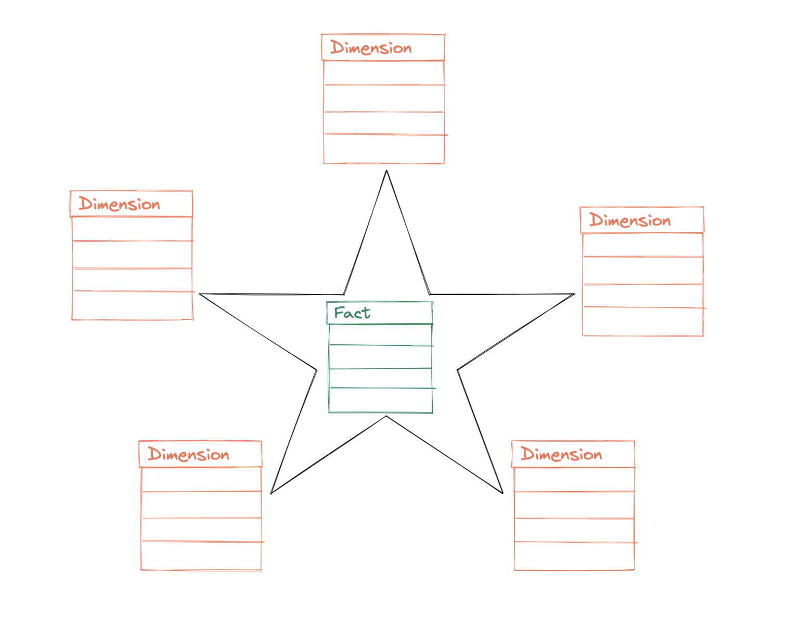

# Dimensional Modeling Schemas

This repository contains SQL schemas and example data for various types of dimensional modeling. Dimensional modeling is used in data warehousing and business intelligence to structure data for efficient querying and reporting.

