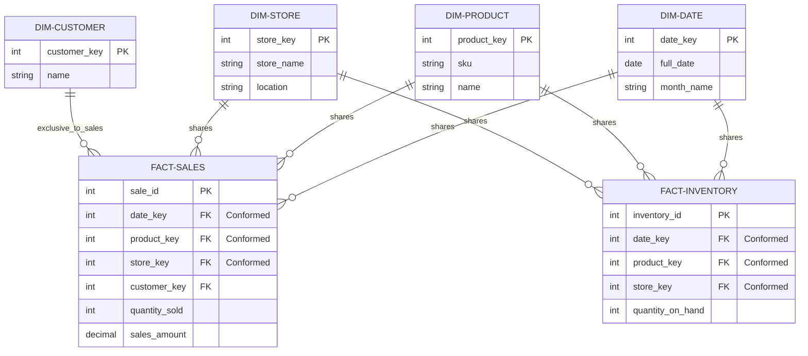

# What Are Conformed Dimensions?

In a dimensional data warehouse, **Conformed Dimensions** are dimension tables that are **shared across multiple fact tables** while maintaining the **same structure, meaning, and keys**.

They serve as the **"glue"** that allows you to integrate data from different business processes. Without conformed dimensions, you would have "data silos" where sales data cannot be compared with inventory or support data.

## Why Use Conformed Dimensions?

- **Drill-Across Analysis**: Allows you to join multiple fact tables on a common dimension (e.g., "Show me Sales vs. Inventory by Product").
- **Consistency**: Ensures that a "Customer" in the Sales department is the exact same "Customer" in the Support department.
- **Efficiency**: Reduces data duplication and simplifies ETL processes.
- **Standardization**: Provides a single source of truth for business entities like Date, Product, or Location.

---

## Visualizing Conformed Dimensions

The following diagram shows how multiple business processes (Facts) share the same reference data (Dimensions). The dimensions marked with **(Conformed)** are shared across the entire warehouse.

---

## Real-World Example: Sales and Inventory

Suppose we want to know if we have enough stock for the products that are selling well. To achieve this, we link `Fact_Sales` and `Fact_Inventory` through our **Conformed Dimensions**.

### Dimensions that represent the Conformed Dimensions:
1.  **`Dim_Product` (Conformed)**: Both facts refer to the exact same product catalog. This allows us to see how much of "Laptop X1" was sold vs. how much is in the warehouse.
2.  **`Dim_Date` (Conformed)**: Both facts use the same calendar logic (e.g., Year, Month, Day). This allows us to compare Sales and Inventory for the exact same point in time.
3.  **`Dim_Store` (Conformed)**: Both facts refer to the same physical or digital locations. This allows us to check if a specific store is running out of stock.

### Drilling Across
By joining both fact tables through `Dim_Product` and `Dim_Date`, we can create a report like this:

| Product | Date | Total Sold | Stock Level | Status |
| :--- | :--- | :--- | :--- | :--- |
| Laptop X | 2023-07-01 | 50 | 5 | **Warning: Low Stock** |
| Laptop X | 2023-07-02 | 10 | 45 | OK |

---

## Types of Conformed Dimensions

1.  **Identically Conformed**: The exact same table (e.g., `Dim_Date`) used by multiple facts.
2.  **Subset Conformed**: A smaller version of a larger dimension that preserves the same keys and structure (e.g., a `Dim_Current_Product` table which is just a subset of `Dim_Product`).
3.  **Overlapping Conformed**: Two dimensions that share a set of common attributes and keys (e.g., `Dim_Employee` and `Dim_Customer` might both conform to a `Dim_Person` structure).

---

## Key Characteristics

| Characteristic | Description |
| :--- | :--- |
| **Same Primary Keys** | The same surrogate or natural keys are used across the warehouse. |
| **Same Business Meaning** | Column values represent the same thing regardless of which fact they describe. |
| **Consistent Granularity** | A row in the dimension represents the same level of detail everywhere. |
| **Shared Structure** | Attribute names and data types are identical. |
