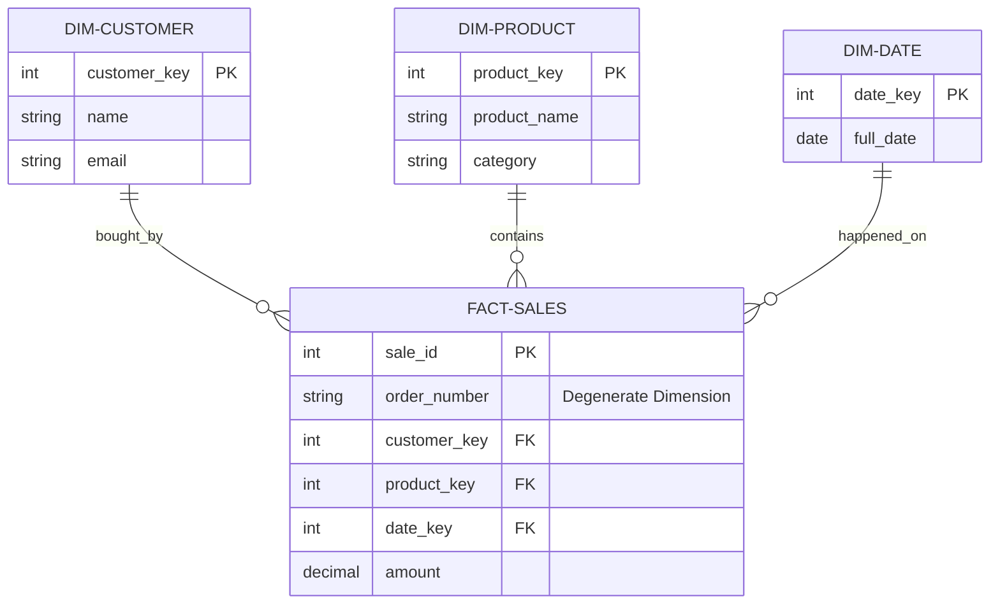

# Degenerate Dimensions

A **Degenerate Dimension (DD)** is a dimension attribute that is stored directly in the **Fact Table** instead of having its own separate dimension table.

## What makes it "Degenerate"?
In traditional dimensional modeling, every descriptive attribute belongs in a dimension table. However, some attributes (like Order Numbers or Invoice Numbers) are unique to the transaction and don't have any additional descriptive data (like a name, color, or category).

Instead of creating a "Dimension Table" with just one column, we "collapse" it into the fact table.

---

## Visualizing Degenerate Dimensions

In the diagram below, `Order_Number` is a Degenerate Dimension. It has no foreign key to an external table because it lives inside the fact.

---

## When to Use Degenerate Dimensions?

You should use a Degenerate Dimension when an attribute:
- **Has no descriptive attributes**: There is no "Order Category" or "Order Color" to store.
- **Is high cardinality**: Almost every row or small group of rows has a unique value.
- **Is used for grouping**: You often want to see "Total amount per Order Number".
- **Identifies the transaction**: It acts as the natural key for the business process (e.g., Ticket ID, Bill of Lading, Policy Number).

---

## Key Benefits
1. **Performance**: Eliminates a JOIN between the fact and a large, skinny dimension table.
2. **Simplified Schema**: Reduces the number of tables in your star schema.
3. **Traceability**: Allows analysts to trace a row in the data warehouse back to the original source system transaction.

