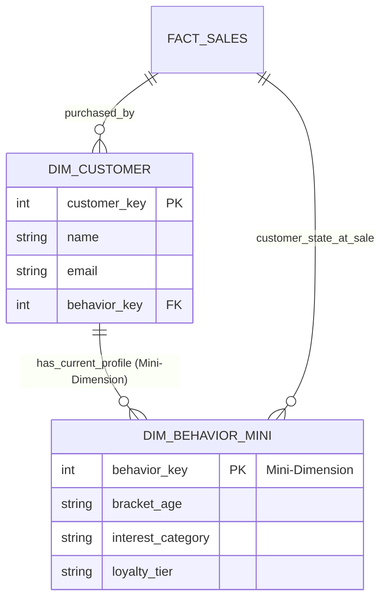
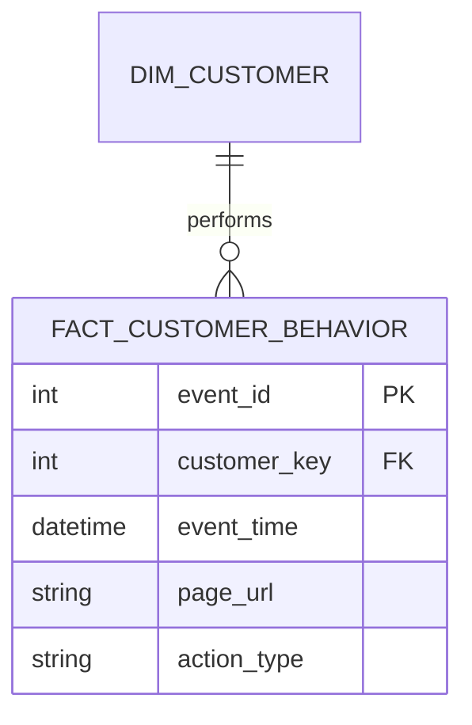

# Fast Changing Dimensions (FCD)

A **Fast Changing Dimension** occurs when certain attributes in a dimension table change much more frequently than others. Using standard **SCD Type 2** for these attributes would lead to massive **row bloat**, as every minor change (like a page view) would create a new version of the entire dimension record.

---

## The Problem: Row Bloat
Imagine a customer dimension where we track "Last Interest" or "Current Session ID". If a customer clicks 100 times a day, SCD Type 2 would create 100 rows per day for that one customer. This quickly becomes unmanageable.

---

## Visualizing the Solutions

### Solution 1: The Mini-Dimension (Profile Snapshot)
We break off the volatile attributes into a separate **Mini-Dimension**. The main dimension then points to this mini-dimension.

### Solution 2: The Behavioral Fact Table (Event Stream)
For extremely high-frequency changes (like raw clicks), we use an **Event-Level Fact Table** to track every specific change as a timestamped event.

---

## Comparison of Approaches

| Feature | Mini-Dimension | Behavioral Fact Table |
| :--- | :--- | :--- |
| **Granularity** | Demographic/Behavioral Buckets. | Atomic events (Clicks, Views). |
| **History** | Snapshots of "state". | Full audit trail of "actions". |
| **Join Cost** | Very low (Direct FK). | Higher (Requires range/time joins). |
| **Use Case** | Scoring, Tiers, Segments. | Path analysis, Attribution models. |

---

## Best Practices
1. **Don't use SCD Type 2** for high-frequency attributes.
2. **Bucket your values**: Instead of storing raw "Session Count", store "Session Range" (e.g., 1-5, 6-10) in the mini-dimension to reduce the number of unique rows.
3. **Hybrid Model**: Use a Mini-Dimension for the current "Customer Profile" and a Fact Table for the historical "Event Stream".
