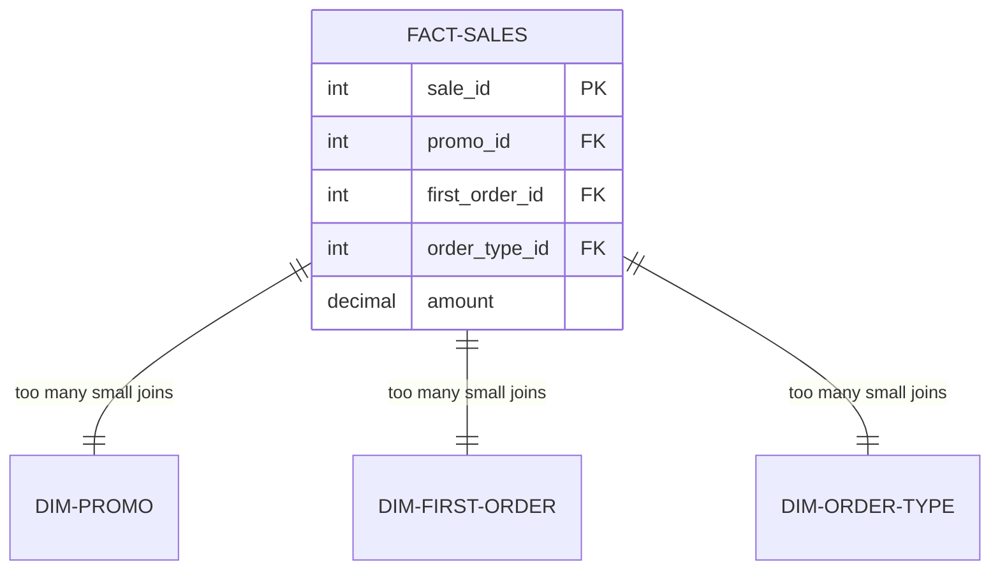
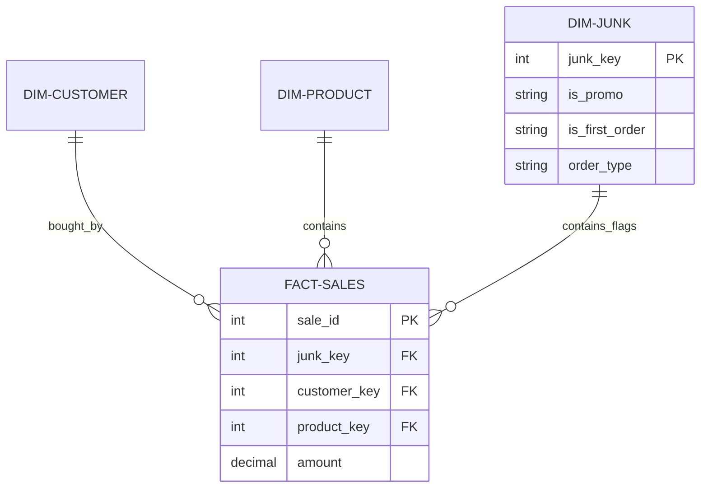

# Junk Dimensions

A **Junk Dimension** is a single dimension table that stores multiple **low-cardinality, unrelated attributes** (flags, indicators, statuses) that don’t belong in their own separate dimension tables.

## Why "Junk"?
The name "Junk" doesn't mean the data is useless. It refers to the fact that we are grouping variety of "bits and pieces" into one place to avoid cluttering our database with dozens of tiny tables (like `Dim_IsPromo`, `Dim_IsGift`, etc.).

---

## Visualizing the Problem (Before vs After)

### Without Junk Dimension (Messy Schema)
The fact table becomes bloated with many small columns and foreign keys.

### With Junk Dimension (Clean Schema)
All small flags are combined into one table, reducing the number of foreign keys in the fact table.

---

## Designing a Junk Dimension: The Cartesian Product

To build a Junk Dimension, you identify all possible combinations of your flags. This is often called a **Cartesian Product**.

| Is_Promo | Is_First_Order | Order_Type | **Junk_Key** |
| :--- | :--- | :--- | :--- |
| Yes | Yes | Online | 1 |
| Yes | No | Online | 2 |
| No | Yes | Online | 3 |
| No | No | Online | 4 |
| Yes | Yes | In-store | 5 |
| ... | ... | ... | ... |

*Note: You don't always need to pre-generate every possible combination; you can also populate the junk dimension "on the fly" as new combinations appear in the source data.*

---

## When to Use Junk Dimensions?

| Criteria | Guidance |
| :--- | :--- |
| **Cardinality** | Attributes should have very few values (e.g., 2-5 values). |
| **Relatedness** | Attributes are NOT naturally related (e.g., "Is_Gift" vs "Ship_Method"). |
| **Schema Complexity** | Use when you have 3+ small flag dimensions to consolidate. |

## Key Benefits
1. **Fact Table Optimization**: Decreases the width of the fact table by replacing multiple columns with a single surrogate key.
2. **Simplified Queries**: Analysts only need to learn one "Junk" dimension instead of five different small tables.
3. **Indexing Efficiency**: Fewer foreign keys mean smaller indexes on the fact table.
