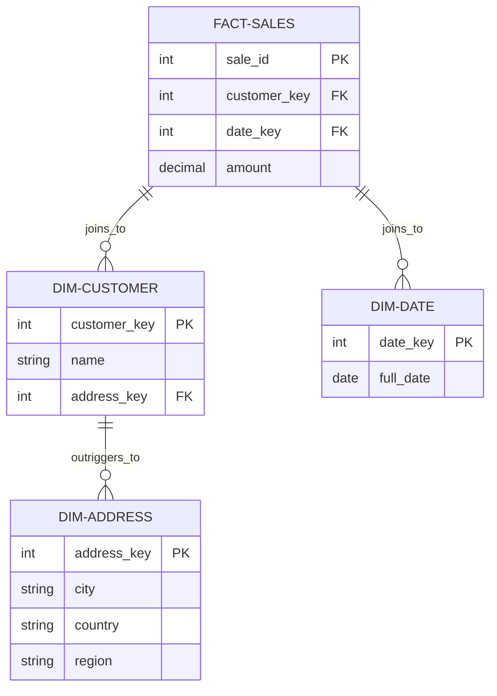

# Outrigger Dimensions

An **Outrigger Dimension** is a secondary dimension table that is linked to a **Main Dimension** instead of being connected directly to the **Fact Table**.

## Concept: "Dimension of a Dimension"
In a standard star schema, all dimensions connect directly to the fact. However, sometimes a dimension contains a set of attributes that are highly repetitive or belong to a separate entity (like an Address or a Credit Score).

Instead of bloating the main dimension, we move those attributes into an "Outrigger" table.

---

## Visualizing Outrigger Dimensions

In this example, the `FACT-SALES` table joins to `DIM-CUSTOMER`. The customer table then "outriggers" to `DIM-ADDRESS`.

---

## When to Use Outrigger Dimensions?

- **Shared Attributes**: When a group of attributes (like Geography) is shared across multiple dimensions (e.g., both Customer and Store have an Address).
- **Reduced Redundancy**: When a dimension has many repetitive attributes that don't change at the same rate as the main dimension.
- **Normalization**: When you need to enforce data integrity for secondary attributes.

---

## Performance Considerations

> [!WARNING]
> While Outriggers help with normalization, they require an **extra JOIN** in your queries.
> `Fact -> Dimension -> Outrigger`
> Too many outriggers turn your Star Schema into a **Snowflake Schema**, which can slow down performance in large-scale data warehouses. Use them sparingly!

## Key Differences

| Feature | Star Schema (Preferred) | Outrigger (Snowflake) |
| :--- | :--- | :--- |
| **Joins** | 1 join to get any attribute. | 2+ joins to get secondary attributes. |
| **Simplicity** | High (easy for analysts). | Medium (analysts must know the chain). |
| **Normalization** | Denormalized (redundant). | Normalized (efficient storage). |

