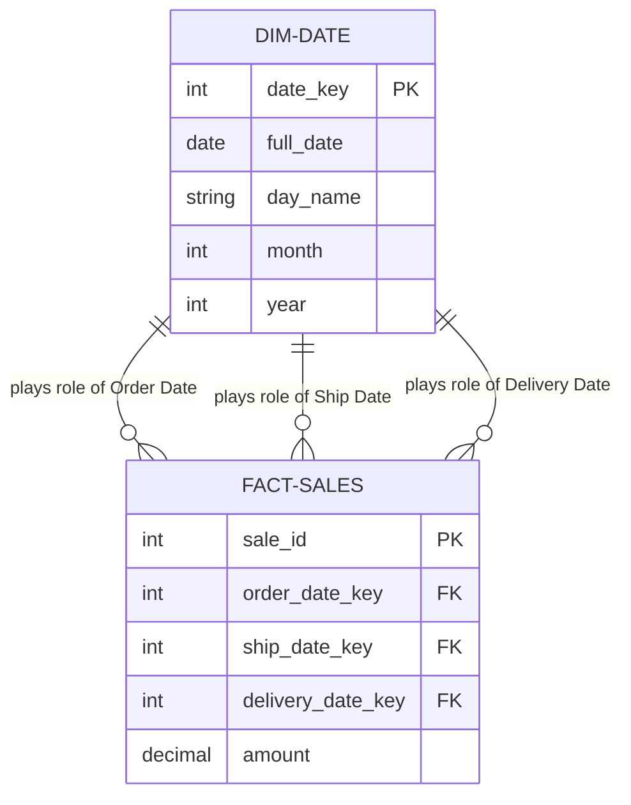

# Role-Playing Dimensions

A **Role-Playing Dimension** is a single physical dimension table that appears multiple times in the same fact table under different **logical roles**.

## The "Actor" Analogy
Think of a single table as an **actor**. In one scene (join), the actor plays the "Order Date". In another scene, the exact same actor plays the "Ship Date". Physically, it's one person (table), but logically, they perform different characters (roles).

---

## Visualizing Role-Playing Dimensions

Instead of creating three different date tables, we join the `Dim_Date` table three times to the `Fact_Sales` table.



---

## Why Use Role-Playing Dimensions?

- **Data Consistency**: All dates follow the same format and calendar logic (fiscal year, holidays, etc.).
- **Reduced Storage**: You only store the calendar data once.
- **Maintenance**: If you need to add a "Holiday" flag, you only add it to one table, and it instantly becomes available for Order, Ship, and Delivery analysis.

---

## Common Business Scenarios

| Subject Area | Physical Table | Multiple Roles |
| :--- | :--- | :--- |
| **Logistics** | `Dim_Location` | Origin Location, Destination Location, Current Location |
| **Sales** | `Dim_Date` | Order Date, Invoice Date, Payment Date, Ship Date |
| **HR** | `Dim_Employee` | Employee, Manager, Mentor, Recruiter |
| **Insurance** | `Dim_Date` | Policy Effective Date, Expiration Date, Claim Date |

---

## How to Query (Aliases are Key!)

Since you are joining the same table multiple times, you **must** use SQL Aliases to distinguish between the roles.

```sql
SELECT 
    f.sale_id,
    ord.full_date AS order_date,
    shp.full_date AS ship_date,
    -- Simple calculation between roles
    (shp.full_date - ord.full_date) AS days_to_ship
FROM Fact_Sales f
JOIN Dim_Date ord ON f.order_date_key = ord.date_key
JOIN Dim_Date shp ON f.ship_date_key = shp.date_key;
```