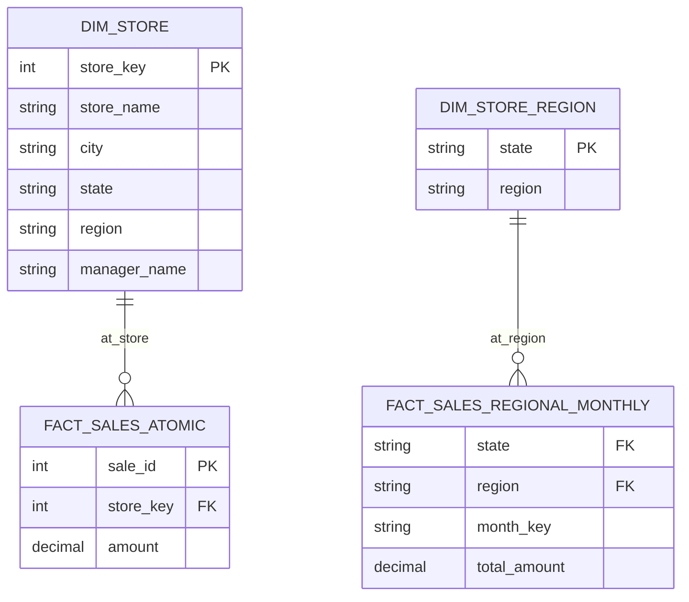

# Shrunken Rollup Dimensions

A **Shrunken Rollup Dimension** (or simply **Shrunken Dimension**) is a **subset** of a larger base dimension. It contains a subset of the rows and/or columns of the original dimension and is used to support **aggregated fact tables**.

## The Concept: Granularity Alignment
In dimensional modeling, fact tables often exist at different levels of detail (grain). 
- An **Atomic Fact** (e.g., individual sales) needs the **Full Dimension**.
- An **Aggregated Fact** (e.g., monthly regional totals) needs a **Shrunken Dimension**.

---

## Visualizing the Shrunken Pattern

The Shrunken Dimension is a "rollup" of the base dimension. It remains **conformed** because the attributes it *does* contain are identical in name and meaning to the base dimension.

---

## Key Benefits

| Benefit | Description |
| :--- | :--- |
| **Performance** | Smaller tables mean faster joins and smaller indexes. |
| **Simplicity** | Aggregated reports don't need to join to massive detailed dimensions. |
| **Consistency** | Since it's a subset of the base dimension, "Region" means the same thing in both. |
| **Storage** | Reduces the footprint of summary-level data marts. |

---

## Star Schema vs. Aggregation Path

| Feature | Base Dimension | Shrunken Dimension |
| :--- | :--- | :--- |
| **Grain** | Atomic (e.g., Individual Store) | Rollup (e.g., State/Region) |
| **Columns** | All attributes (Manager, Address, etc.) | Only grouping attributes. |
| **Fact Table** | Transactional (Item level) | Aggregated (Monthly/Daily summary) |

---

## Implementation Note
Shrunken dimensions can be implemented as:
1. **Physical Tables**: Best for performance in large-scale warehouses.
2. **Database Views**: `SELECT DISTINCT region, state FROM dim_store`. Best for maintenance (logic is in one place).
imension.
