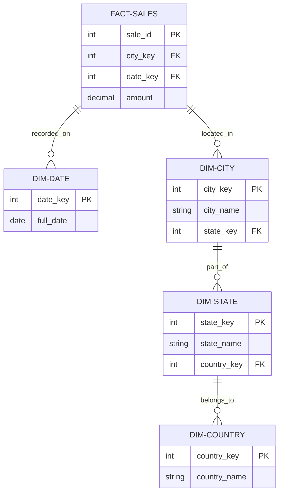

# Snowflake Dimensions

A **Snowflake Dimension** is a data modeling technique where a dimension table is **normalized** into multiple related tables. This creates a hierarchy that resembles a snowflake when visualized.

## Concept: Normalization vs. Denormalization
In a standard **Star Schema**, dimensions are "flat" (denormalized). In a **Snowflake Schema**, we break hierarchies (like Geography or Product Category) into separate tables to reduce redundancy.

---

## Visualizing the Snowflake Pattern

In this model, the `FACT-SALES` table joins to `DIM-CITY`. The hierarchy then flows outwards: `City -> State -> Country`.



---

## Star Schema (Flat) vs. Snowflake Schema

| Feature | Star Schema (Flat) | Snowflake (Normalized) |
| :--- | :--- | :--- |
| **Structure** | Single table per dimension. | Multiple tables per dimension. |
| **Data Redundancy** | High (e.g., 'USA' repeated for every city). | Low (e.g., 'USA' stored once in Country table). |
| **Joins** | Fewer (better performance). | More (can be slower). |
| **Usability** | Simple for end-users to query. | More complex for end-users. |

---

## When to Use Snowflake Dimensions?

- **Sparse Attributes**: When many attributes in a dimension only apply to a small subset of rows.
- **Large Dimensions**: When a dimension is massive and normalization significantly saves storage space.
- **Complex Hierarchies**: When hierarchies are deep and data integrity is a top priority.

---

## Querying the Hierarchy

To get a complete report, you must join through the entire chain.

```sql
SELECT 
    f.sale_id,
    c.city_name,
    s.state_name,
    co.country_name,
    f.amount
FROM Fact_Sales f
JOIN Dim_City c ON f.city_key = c.city_key
JOIN Dim_State s ON c.state_key = s.state_key
JOIN Dim_Country co ON s.country_key = co.country_key;
```

---

## Key Benefits
- **Storage Efficiency**: Drastically reduces data redundancy.
- **Data Integrity**: Enforces hierarchical rules through foreign key constraints.
- **Maintenance**: Updates to a parent level (e.g., renaming a Country) only happen in one place.


